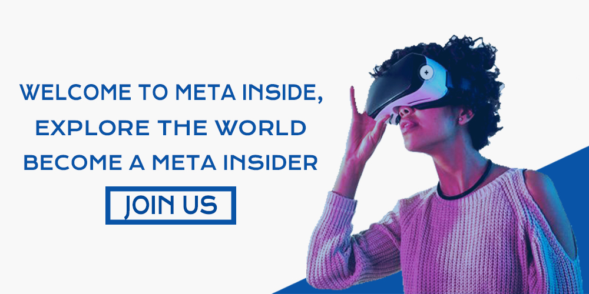

# MetaInside

# Design that Brings Creativeness

We’re the global creative platform where designers and clients work together and inspire one another. It’s never been easier to collaborate and create designs.

## Welcome to Meta Inside

Welcome to Meta Inside, Explore the World to Become a Meta Insider (Join Us)

  

## Home Page Interface

Find the Best Graphic Design Services

  

## Make Business Smarter 

Make Business Smarter

  

## Become a Metainsider

Become a Metainsider

  

## Login Page

Login Page

  

# MetaInside (Newer Environment/Functionalities)

- Newer Environment 
  - `Desktop` Application
  - `Android` Application

- Functionalities
  - `Redesigning` Website
  - `Better User Interface` Interactions
  - `Community Discussion Tab and Customer Support` Functionality
  - `Forget Password, 2FA and Other Email  Notification`Functionality

# MetaInside Statistics

##### The `Project` is `Uncompleted & Pending` 

##### `Right` Are Reserved `©`2022 `MetaInside` 

## Support 💓

Support at <a href="https://www.patreon.com/ossamamehmood" target="_blank">Patreon</a>

<tr><td align="center"><a href="https://github.com/ossamamehmood"><kbd></kbd> <b>Ossama Mehmood</b></a></tr>
 <b>Sole proprietorship 
& Founder</b></a>
